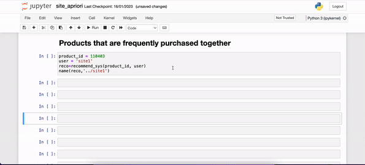
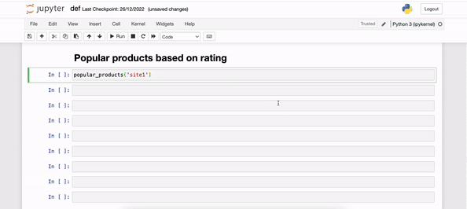
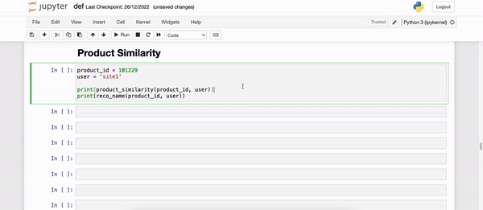
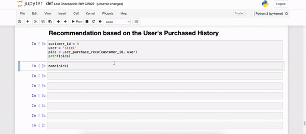

# Recommendation System Using TensorFlow

## Overview

This recommendation system is implemented using TensorFlow and involves several key components for building a collaborative filtering model. Here's a brief overview of the main functionalities:

1. **Data Preparation:**
   - The `product_df` function loads the dataset from the CSV file, creating a TensorFlow dataset for product information, including product IDs and short descriptions.

2. **Vocabulary Creation:**
   - The `vocabulary` function creates vocabularies using TensorFlow's `StringLookup` layer for both product IDs and categories based on unique short descriptions.

3. **Model Architecture:**
   - The `RecommendModel` class defines the collaborative filtering model using user and product embeddings. It uses TensorFlow Recommenders (tfrs) to set up a retrieval task.

4. **Neural Network Configuration:**
   - The `neural_net` function sets up the neural network architecture for product IDs and categories, incorporating embeddings layers.

5. **Training:**
   - The `train` function trains the collaborative filtering model using the provided dataset and neural network configuration. The model is compiled with the Adam optimizer and Mean Squared Error (MSE) loss.

6. **Model Loading:**
   - The `load_model` function loads the trained model from the saved weights and sets up a brute-force search index for retrieval.

7. **Recommendation Generation:**
   - The `recommendation` function takes a product ID as input, retrieves similar products using the trained model, and returns a list of recommended product IDs.

8. **Name Retrieval Testing:**
   - The `reco_name_testing` function fetches the names of the recommended products.

## Usage

1. **Data Loading:**
   - Ensure your dataset is in the appropriate CSV format and adjust the path in the `product_df` function.

2. **Vocabulary Creation:**
   - Use the `vocabulary` function to create vocabularies for product IDs and categories.

3. **Model Training:**
   - Run the `train` function to train the collaborative filtering model.

4. **Model Loading:**
   - Use the `load_model` function to load the trained model.

5. **Recommendation Generation:**
   - Call the `recommendation` function with a product ID to get a list of recommended product IDs.

6. **Name Retrieval Testing:**
   - Run the `reco_name_testing` function to obtain the names of the recommended products.

# Quick Demo











# Association Rules Learning Using Apriori

This script uses the Apriori algorithm to generate association rules and recommends top N products for a given target product.

## Usage

1. **Install Dependencies:**
   - Install the required libraries by running:
     ```bash
     pip install -r requirements.txt
     ```

2. **Run the Script in Jupyter Notebook:**
   - Open a Jupyter Notebook.
   - Execute the cell to see the top N recommended products for the specified target product.


3. **Output:**
   - The script will output the top N recommended products for the specified target product.

## Parameters

- `data_path`: Path to the CSV file containing the dataset.
- `target_product_id`: The target product for which recommendations will be generated.
- `min_support`: Minimum support threshold for the Apriori algorithm. Default is 0.01.
- `min_threshold`: Minimum threshold for association rules. Default is 0.01.
- `top_n`: Number of top recommendations to return. Default is 5.

